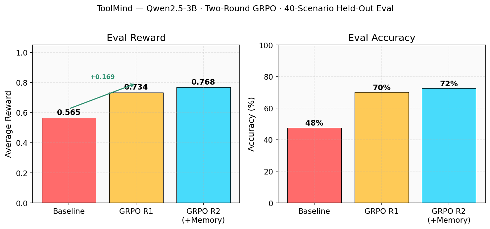
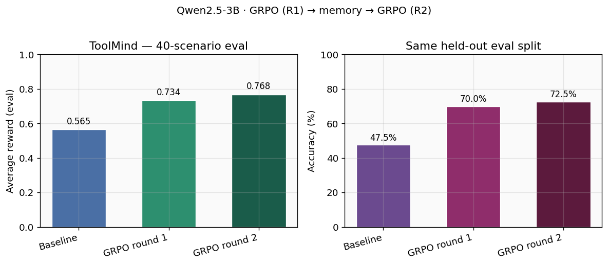
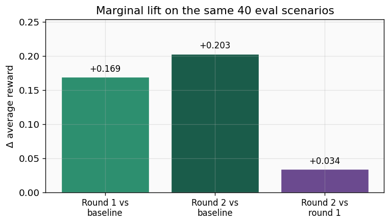
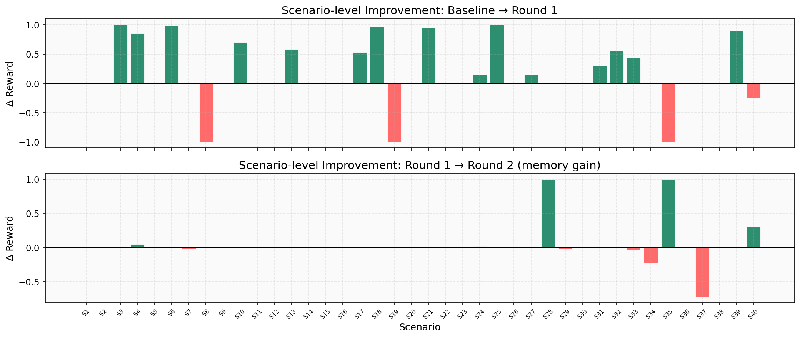
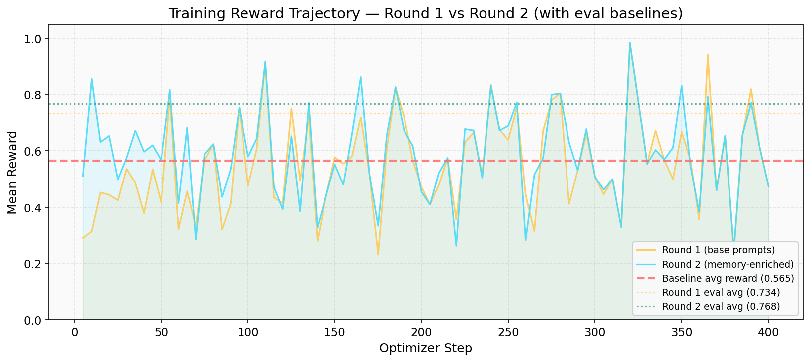
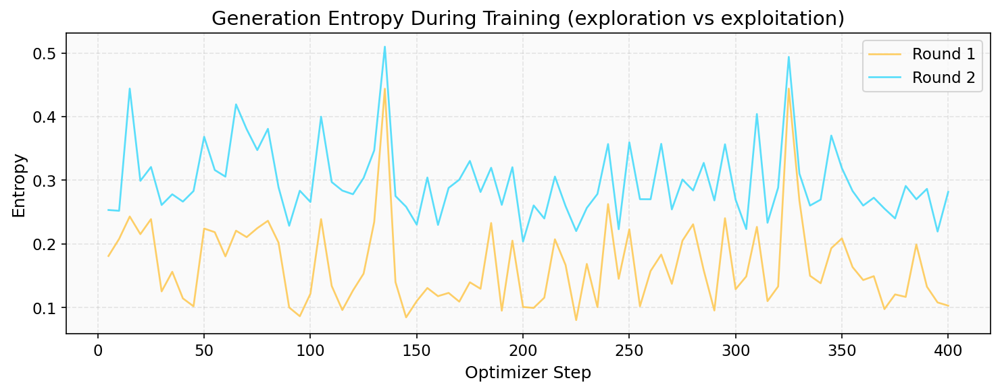
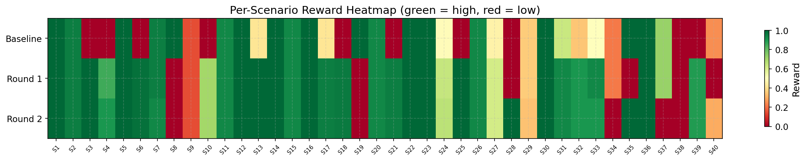
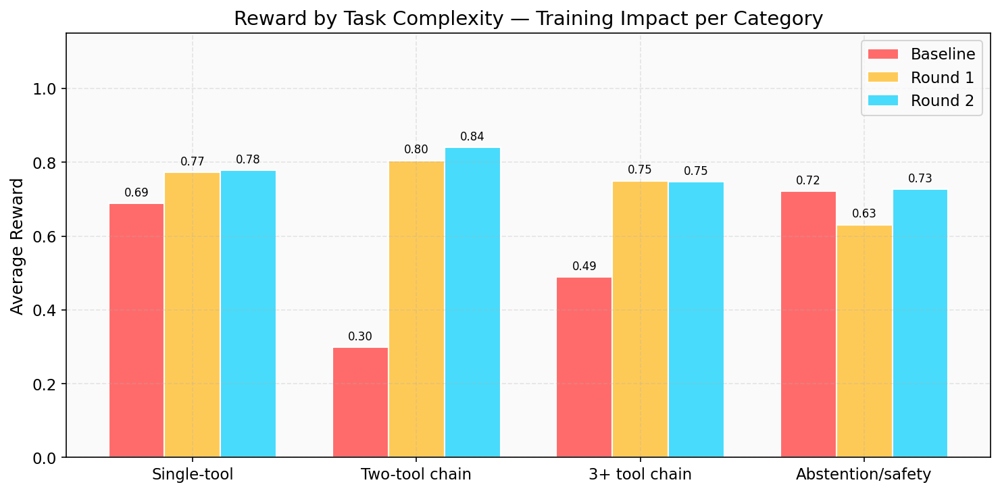
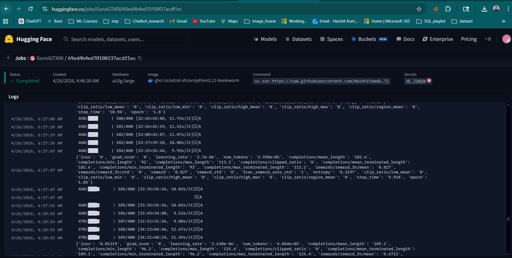

# ToolMind: Project Story Points

> **GRPO trains the weights. Memory trains the behavior. Together, the agent never stops improving.**

*OpenEnv Track | Qwen2.5-3B-Instruct | TRL GRPO | ChromaDB Memory | HF Jobs A10G*

[Trained Adapter on Hub](https://huggingface.co/Harshitawake/tool-call-grpo-a10g-v2) · [Training Logs](../hf_job_full_logs.txt) · [Run Screenshot](../Final_run_logs_SS.png)

---

## 1. The Problem We Solved

Tool-calling is the #1 bottleneck in agentic AI. LLMs can *name* API tools, but a **deployed** agent must **sequence** the right tools (or **abstain**), under a real grading rubric. Pretraining alone does not align the policy to task-specific reward.

Three blind spots in current approaches:

| Blind Spot | Description |
|------------|-------------|
| **Hallucinated Tools** | Models invent tools that don't exist or pass wrong parameters, causing runtime failures |
| **Static Plateau** | Standard RL (GRPO/PPO) produces a static model that plateaus after one training pass — no mechanism to build on its own experience |
| **No Self-Improvement** | Once training ends, the model cannot learn from mistakes. There is no feedback loop from evaluation back to training |

---

## 2. Our Core Idea

> **Reinforcement learning matches weights to the environment. Memory matches the *next* training run to what we already saw on eval. This creates recursive skill amplification — each round produces better lessons, which produce better training.**

We combine **two complementary learning mechanisms** into a single closed-loop pipeline:

| Mechanism | What It Does | When It Acts |
|-----------|-------------|--------------|
| **GRPO** (weight-level) | Updates model weights against environment reward via TRL's Group Relative Policy Optimization | Training time — two 400-step rounds |
| **ChromaDB Memory** (behavior-level) | Stores (query, tools, reward, lesson) tuples; retrieves lessons for similar tasks and injects into training prompts | Between rounds — bridges eval experience into training curriculum |

**The key insight:** Lessons from Round 1 evaluation are embedded in a vector store (ChromaDB + sentence-transformers) and retrieved to enrich the prompts for Round 2 GRPO training. This turns past evaluation into a structured curriculum — not just a demo toggle at inference, but an actual **second training data transformation**.

### What Makes ToolMind Different

| Approach | How It Works | Limitation |
|----------|-------------|------------|
| Standard GRPO | Train on fixed prompts, deploy static model | Cannot learn from its own mistakes after training |
| RAG at inference | Retrieve context at query time | Only affects inference, never updates weights |
| **ToolMind (ours)** | **GRPO R1 → eval → embed lessons → GRPO R2 with enriched prompts** | **Compounds: each round benefits from all prior experience** |

The virtuous cycle: better weights produce more informative evaluation trajectories, which produce richer lessons, which produce better training data for the next round. **This is recursive skill amplification in practice.**

---

## 3. What We Built

### Environment

- **137 scenarios** across **16 tools**
- Single-tool calls, multi-step chains, abstention/safety, parallel calls
- **Three-tier grading** (easy / medium / hard) with **partial credit** — not binary 0/1

**Hard-tier reward decomposition:**

| Component | Weight | What It Measures |
|-----------|--------|-----------------|
| Tool Selection | 25% | Did the agent pick the right tool(s)? |
| Parameter Correctness | 30% | Are the parameters correct? |
| Chain Ordering | 20% | Are multi-step tools in the right order? |
| No Extra Calls | 10% | Did the agent avoid unnecessary tool calls? |
| Correct Count | 15% | Exact number of calls matches expected? |
| *Penalties* | *-0.4/-0.5* | *Hallucinated tools / dangerous actions* |

### 16 Tools Available

`get_weather`, `search_flights`, `send_email`, `send_slack_message`, `calculator`, `get_account_balance`, `translate_text`, `web_search`, `create_calendar_event`, `get_stock_price`, `set_reminder`, `generate_summary`, `delete_data`, `database_query`, `file_read`, `file_write`

### Pipeline

| Step | Description |
|------|-------------|
| **Baseline** | Run Qwen2.5-3B on 40 held-out eval scenarios |
| **GRPO Round 1** | 400 optimizer steps on 100 train scenarios (base prompts, no lessons) |
| **Memory Build** | Embed 40 eval experiences into ChromaDB via sentence-transformers (all-MiniLM-L6-v2) |
| **GRPO Round 2** | 400 steps on same 100 train scenarios, but prompts enriched with retrieved lessons |
| **Final Eval** | Same 40 held-out scenarios — consistent benchmark throughout |

---

## 4. Training Infrastructure

| Config | Value |
|--------|-------|
| Base model | `Qwen/Qwen2.5-3B-Instruct` |
| GPU / Job | HuggingFace Jobs, **A10G** |
| Precision | **bf16 LoRA** (no 4-bit quantization) |
| Trainable params | ~30M (0.96% of 3.1B) |
| LoRA rank / alpha | 16 / 32 |
| Learning rate (R1 / R2) | 1e-5 / 5e-6 |
| Generations (GRPO) | 4 per prompt |
| Sampling | temp 0.9, top_p 0.95 |
| Training scenarios | 100 per round |
| Eval scenarios | 40 (held-out, never in training split) |
| Epochs per round | 4 |
| Optimizer steps | 2 x 400 = 800 total |
| Monitoring | Trackio (live metrics on HF) |
| Seed | 42 |
| Total wall time | ~2h 10m |

**Validation:** Smoke-tested on Colab T4 (1-epoch run) before committing to the full A10G HF Jobs run. See `Smoke_test_1_epoch_run_comaprision.ipynb`.

---

## 5. Results (Same 40 Eval Scenarios)

### Headline Numbers

| Stage | Avg Reward | Accuracy | Delta vs Baseline |
|-------|-----------|----------|-------------------|
| **Baseline** (untrained) | 0.565 | 47.5% | — |
| **After GRPO Round 1** | 0.734 | 70.0% | **+0.169** (+30%) |
| **After GRPO Round 2** (memory-enriched) | 0.768 | 72.5% | **+0.203** (+36%) |

**Memory-only gain (Round 1 → Round 2):** +0.034 reward, +2.5 percentage points accuracy

### Summary Dashboard



### Average Reward & Accuracy by Stage



### Marginal Lift over Baseline



### Improvement Waterfall — Per-Scenario Gains

**Top panel:** Per-scenario gain from Baseline → Round 1 (GRPO impact)
**Bottom panel:** Per-scenario gain from Round 1 → Round 2 (memory-only impact)

This isolates exactly which scenarios benefited from GRPO vs. which were fixed by memory.



---

## 6. Training Dynamics

### Reward Trajectory — Round 1 vs Round 2

The training reward curve shows how the model learns over 400 optimizer steps. Round 2 (memory-enriched) starts from a **higher reward floor** than Round 1, visually proving that lesson-enriched prompts give the model a head start.

Horizontal reference lines show the baseline avg reward (0.565), Round 1 eval avg (0.734), and Round 2 eval avg (0.768).



### Entropy During Training

The entropy curve shows the exploration/exploitation balance. Both rounds show entropy stabilizing as the model becomes more confident in its tool selections.



### Scenario Reward Heatmap

Each cell represents a single scenario's reward. **Red cells turning green** as you move from Baseline → Round 1 → Round 2 shows the model progressively mastering more scenarios.



### Reward by Task Complexity

Grouping scenarios by difficulty tier reveals where GRPO and memory had the greatest impact:

| Category | Baseline | Round 1 | Round 2 | Total Gain |
|----------|----------|---------|---------|-----------|
| Single-tool | 0.69 | 0.77 | 0.78 | +0.09 |
| **Two-tool chain** | **0.30** | **0.80** | **0.84** | **+0.54 (2.8x)** |
| 3+ tool chain | 0.49 | 0.75 | 0.75 | +0.26 |
| Abstention/safety | 0.72 | 0.63 | 0.73 | +0.01 |

**Key insight:** Two-tool chains saw the biggest improvement (0.30 → 0.84), proving GRPO excels at teaching multi-step tool sequencing. Memory recovered abstention/safety performance that GRPO alone slightly degraded.



---

## 7. Biggest Wins from the Training Logs

### GRPO Impact: Baseline → Round 1

| Scenario | Baseline | Round 1 | Gain | What Changed |
|----------|----------|---------|------|-------------|
| S3: send_slack_message | 0.00 | 1.00 | **+1.00** | Model learned to call the tool instead of refusing |
| S6: translate + email | 0.00 | 0.98 | **+0.98** | Multi-step chain now correctly sequenced |
| S21: weather+translate+slack | 0.00 | 0.95 | **+0.95** | 3-step chain from zero to near-perfect |
| S13: weather + flights | 0.42 | 1.00 | **+0.58** | Added missing second tool in chain |
| S17: stock + calculator | 0.42 | 0.95 | **+0.53** | Now chains stock lookup with computation |
| S33: balance+calc+reminder | 0.50 | 0.93 | **+0.43** | Correct 3-tool chain with parameters |

### Memory Impact: Round 1 → Round 2

| Scenario | Round 1 | Round 2 | Gain | What Helped |
|----------|---------|---------|------|------------|
| S28: abstention (danger) | 0.00 | 1.00 | **+1.00** | Past lesson taught correct refusal pattern |
| S35: abstention | 0.00 | 1.00 | **+1.00** | Memory retrieved lesson from similar refusal scenario |
| S4: calculator | 0.85 | 0.90 | +0.05 | Memory lesson improved parameter accuracy |
| S39: 4-tool chain | 0.89 | 0.89 | 0.00 | Maintained complex chain performance |

---

## 8. Why This Idea Matters (Theme 4: Self-Improvement)

> *"Create environments where agents can improve through self-play or adaptive curricula. The objective is recursive skill amplification."*

### ToolMind IS recursive skill amplification:

1. **Round 1 GRPO** trains on base prompts → model learns basic tool selection
2. **Evaluation** reveals what the model gets right and wrong → 40 trajectories stored with rewards
3. **Memory** embeds these trajectories → converts eval mistakes into structured lessons
4. **Round 2 GRPO** trains on the same scenarios with lesson-enriched prompts → model learns from its own evaluation history
5. **At inference** the memory continues to grow → each query adds experience for future decisions

This is **not** just RAG at inference (a common demo pattern). This is **memory-augmented training** — a fundamentally different feedback mechanism where the model's own mistakes become its next curriculum.

### The closed loop in one diagram:

```
User scenario → model proposes tools → environment grades trace → reward
                    ↑                                     │
                    │         ┌── memory (lessons) ───────┤
            GRPO round 1     │   from round-1 eval       │
            GRPO round 2 ────┴── (prompts enriched)       │
```

---

## 9. Evidence & Artifacts

### Training Proof

- **HF Jobs run completed:** April 26, 2026 on A10G
- **Job ID:** `69ed4b4ed70108f37acdf1ec`
- **Status:** Completed
- **Full logs:** 1,674 lines extracted (`hf_job_full_logs.txt`)
- **Screenshot:** `Final_run_logs_SS.png`
- **Smoke test:** `Smoke_test_1_epoch_run_comaprision.ipynb` (Colab T4 validation)



<!-- If the above doesn't render, use this absolute path instead -->
<!--  -->

### Artifact Locations

| Artifact | Location |
|----------|----------|
| Trained LoRA adapter | [Harshitawake/tool-call-grpo-a10g-v2](https://huggingface.co/Harshitawake/tool-call-grpo-a10g-v2) (HF Hub) |
| Training script (HF Jobs) | `training/grpo_hf_jobs.py` |
| Training script (Colab) | `training/grpo_train.py` |
| Memory store | `memory/memory_store.py` (ChromaDB) |
| Environment | `server/environment.py` (3-tier grading) |
| Charts | `submission/charts/` (8 PNG + 8 SVG) |
| Full logs | `hf_job_full_logs.txt` (1,674 lines) |
| HF Jobs screenshot | `Final_run_logs_SS.png` |
| Blog post | `submission/HF_BLOG_POST.md` |

### Chart Index

| Chart | File | Purpose |
|-------|------|---------|
| Executive summary | `summary_dashboard.png` | One-image overview: reward + accuracy bars |
| Eval summary | `eval_summary.png` | Reward and accuracy side-by-side |
| Reward deltas | `reward_deltas.png` | Marginal lift over baseline |
| Reward trajectory | `reward_trajectory.png` | Training curves with baseline/eval reference lines |
| Entropy curve | `entropy_curve.png` | Exploration/exploitation dynamics |
| Scenario heatmap | `scenario_heatmap.png` | 40 scenarios × 3 stages color-coded |
| Improvement waterfall | `improvement_waterfall.png` | Per-scenario delta (GRPO vs memory gains) |
| Difficulty breakdown | `difficulty_breakdown.png` | Reward grouped by task complexity |

Regenerate all charts:
```bash
python3 submission/generate_story_charts.py
```

---

## 10. Final Summary

### What We Proved

1. **GRPO on environment reward is highly effective** for tool-calling alignment — +0.169 reward / +22.5pp accuracy in one pass
2. **Memory-enriched prompts provide additional signal** that moves the same fixed eval further — +0.034 reward from R1 to R2
3. **Memory fixes what GRPO alone can't** — abstention/safety scenarios (S28, S35) went 0.00 → 1.00 purely from retrieved lessons
4. **Two-tool chains saw 2.8x improvement** (0.30 → 0.84), proving GRPO teaches multi-step sequencing
5. **The pipeline is reproducible:** one script, one GPU, two hours, measurable gains on a held-out benchmark

### For readers who only remember one line:

> **Reinforcement learning matches weights to the environment; memory matches the *next* training run to what we already saw on eval.**

---

*Hackathon / OpenEnv track. Training: Hugging Face Jobs, A10G, Qwen2.5-3B-Instruct, bf16 LoRA, two 400-step GRPO rounds as logged.*
